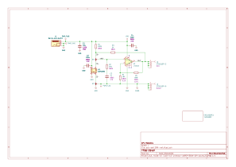
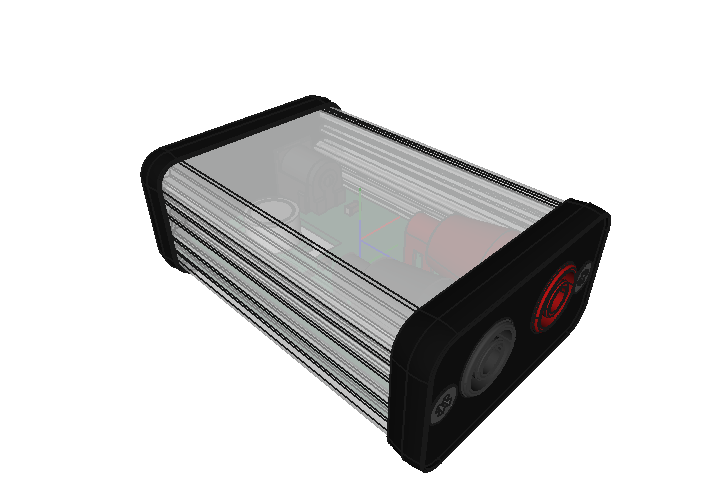

# pcb-adr1399-vref

**NOTICE** - The main branch is probably not production ready. Check out [Releases](https://github.com/Atmelfan/pcb-adr1399-vref/releases) for finished revisions.

A simple 10 V voltage reference based on [ADR1399](https://www.analog.com/en/products/adr1399.html) from Analog Devices.

# Schematic

Check out [Releases](releases) for revision schematics and materials.

# License
This work is licensed under [CERN Open Hardware Licence Version 2 - Strongly Reciprocal](https://www.ohwr.org/project/cernohl/wikis/Documents/CERN-OHL-version-2).

See [LICENSE.txt](LICENSE.txt) for full text.